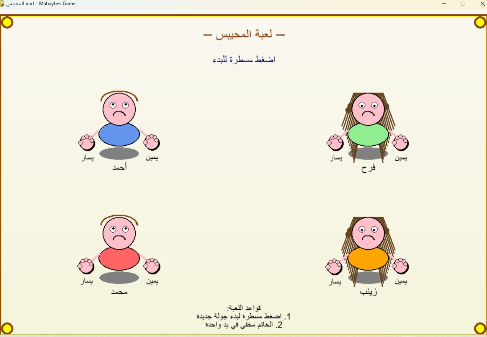

# 🎮 لعبة المحيبس - Mahaybes Game

لعبة محيبس تفاعلية مبنية بلغة بايثون باستخدام مكتبة Pygame، مستوحاة من اللعبة الشعبية العراقية الشهيرة.  
اللعبة تحتوي على رسوم كرتونية، دعم للغة العربية، حركة عيون ديناميكية، ومؤثرات صوتية عند الفوز والخسارة.

---

## 🖼️ صورة من اللعبة



---

## 🧩 الميزات

- ✅ 4 لاعبين برسوم مرسومة ومتحركة
- ✅ حركة عيون تلقائية (أنيميشن)
- ✅ اختيار يد اللاعب بالنقر
- ✅ دعم اللغة العربية 100%
- ✅ مؤثرات صوتية للفوز والخسارة
- ✅ واجهة سهلة مع تعليمات على الشاشة

---

## 🛠️ المتطلبات

- Python 3.8 أو أحدث
- pygame
- numpy
- arabic_reshaper
- python-bidi

🔧 التثبيت:

```bash
pip install pygame numpy arabic_reshaper python-bidi
